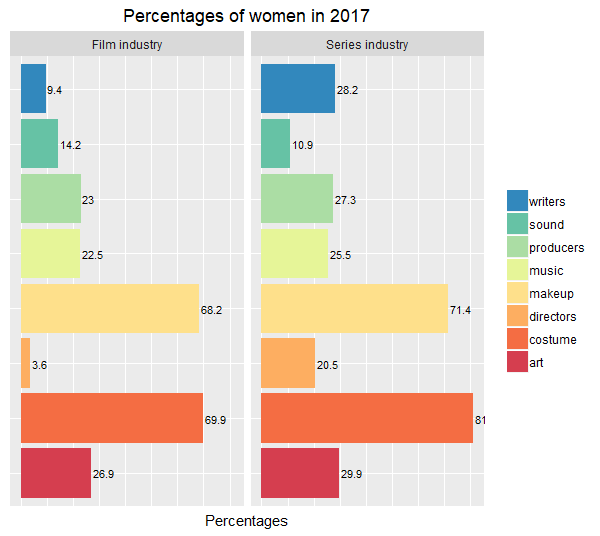

# Gender diversity in the series industry

## Introduction
In a previous post, I studied the gender diversity in the film industry, by focusing on some key **behind-the-camera roles** and measuring the evolution of their gender diversity in the last decade. The conclusion was not great: women are under-represented, especially in the most important roles of directors and writers, while these key roles determine the way women are portrayed in front of the camera. 

I was curious about the series industry too: **as series are a more recent area than movies, they might be more open to women?** I decided to have a look.

In this post, as in the film industry one, the behind-the-camera roles I studied were the following: **directors**, **writers**, **producers**, **sound teams**, **music teams**, **art teams**, **makeup teams** and **costume teams**.

The whole code to reproduce the following results is available on [`GitHub`](https://github.com/MangoTheCat/Gender-diversity-series-industry).

## Data Frame Creation - Web Scraping
Here again, all the data I used was gathered from the **IMDb website**: I went through the [`100 Most Popular TV Shows`](https://www.imdb.com/chart/tvmeter?sort=rk,asc&mode=simple&page=1) (according to the IMDb ratings), and gathered some useful information about these 100 series: I built a data frame which contains the titles of these series, their years of release and their IMDb episode links - the link where we can find all the episodes of a series. 

```{r top_series, eval=FALSE}
# IMDb 100 most popular TV shows ------------------------------

url <- "https://www.imdb.com/chart/tvmeter?sort=us,desc&mode=simple&page=1"
page <- read_html(url)

serie_nodes <- html_nodes(page, '.titleColumn') %>%
  as_list()

# Series details
serie_name <- c()
serie_link <- c()
serie_year <- c()
for (i in seq_along(serie_nodes)){
  serie_name <- c(serie_name, serie_nodes[[i]]$a[[1]])
  serie_link <- c(serie_link, attr(serie_nodes[[i]]$a, "href"))
  serie_year <- c(serie_year, serie_nodes[[i]]$span[[1]])
}
serie_link <- paste0("http://www.imdb.com",serie_link)
serie_year <- gsub("[()]", "", serie_year)
serie_episodelist <- sapply(strsplit(serie_link, split='?', fixed=TRUE),
                            function(x) (x[1])) %>%
  paste0("episodes?ref_=tt_eps_yr_mr")


# Create dataframe ----------------------------------------------
top_series <- data.frame(serie_name, serie_year, serie_episodelist, stringsAsFactors = FALSE)


# serie_year was the date of 1st release but we needed the years of release for all the episodes
# I did not manage to gather this information by doing some web scraping.
# I added it manually as it is available on the IMDb episodes links (column serie_episodelist)
```

```{r show top_series}
top_series[20:30, ]
```

The `series_year` column often contains several years. For example, for the series called "This is us", it means that episodes have been released in 2016, 2017 and 2018. This column will allow me to split the episodes by year of release, and then visualise the gender diversity of the crew for each year.


## List Creation - Web Scraping
At this stage, I just had some global information on the 100 series. The next step was to go through the IMDb links gathered in the column `series_episodelist` of my `top_series` data frame, which give me access to all the series episodes split by year of release. I did some **web scraping** on these links and built a list which gathered:

* the names of the 100 most popular TV shows 

* for each series, the different years of release

* for each year, the names of the episodes which have been released

* for each episode, the names of the people whose job was included in one of the categories I listed above (directors, writers, ..., costume teams)

``` {r series_list, eval=FALSE}
### Create series list

series_list <- list()

# FOCUS ON EACH SERIE -----------------------------------------------------------------
for (r in seq_len(nrow(top_series))) { 
  
  serie_name <- top_series[r, "serie_name"]
  print(serie_name)
  
  # Years of release for each serie
  list_serieyear <- as.list(strsplit(top_series[r, "serie_year"], split = ", ")[[1]]) 
  # List of IMDb links where we find all the episodes per year of release
  link_episodelist_peryear <- list() 
  
  episodes_list_peryear <- list()
  
  # FOCUS ON EACH YEAR OF REALEASE FOR THIS SERIE -------------------------------------
  for (u in seq_along(list_serieyear)){ 

    year <- list_serieyear[[u]]
    print(year)
    
    link_episodelist_yeari <- strsplit(top_series[r, "serie_episodelist"], split='?', fixed=TRUE)[[1]][1] %>%
      paste0("?year=", year, collapse = "")
    link_episodelist_peryear[[u]] <- link_episodelist_yeari
    
    # FOCUS ON EACH EPISODE FOR THIS YEAR OF RELEASE ----------------------------------
    for (l in seq_along(link_episodelist_peryear)){ 
      
      page <- read_html(link_episodelist_peryear[[l]]) 
      episodes_nodes <- html_nodes(page, '.info') %>%
        as_list()
      
      episode_name <- c()
      episode_link <- c()
      
      for (t in seq_along(episodes_nodes)){
        episode_name <- c(episode_name, episodes_nodes[[t]]$strong$a[[1]])
        episode_link <- c(episode_link, attr(episodes_nodes[[t]]$strong$a, "href"))
      }
      
      episode_link <- paste0("http://www.imdb.com",episode_link)
      episode_link <- sapply(strsplit(episode_link, split='?', fixed=TRUE), 
                             function(x) (x[1])) %>%
        paste0("fullcredits?ref_=tt_ql_1")
      
      episode_name <- sapply(episode_name, 
                             function(x) (gsub(pattern = "\\#", replacement = "", x)))  %>% # some names = "Episode #1.1"
        as.character()
      
      # GATHER THE NAME OF THE EPISODE, ITS YEAR OF RELEASE AND ITS FULL CREW LINK ----
      episodes_details_peryear <- data.frame(year = year,
                                             episode_name = episode_name,
                                             episode_link = episode_link,
                                             stringsAsFactors = FALSE)
    }
    
    # FOCUS ON EACH FULL CREW LINK ----------------------------------------------------
    for (e in seq_len(nrow(episodes_details_peryear))){
      
      print(episodes_details_peryear[e, "episode_link"])
      
      episode_page <- read_html(episodes_details_peryear[e, "episode_link"])
      episode_name <- episodes_details_peryear[e, "episode_name"]
      
      # GATHER ALL THE CREW NAMES FOR THIS EPISODE -------------------------------------
      episode_allcrew <- html_nodes(episode_page, '.name , .dataHeaderWithBorder') %>%
        html_text()
      episode_allcrew <- gsub("[\n]", "", episode_allcrew) %>%
        trimws() #Remove white spaces 
      
      # SPLIT ALL THE CREW NAMES BY CATEGORY -------------------------------------------
      episode_categories <- html_nodes(episode_page, '.dataHeaderWithBorder') %>%
        html_text()
      episode_categories <- gsub("[\n]", "", episode_categories) %>%
        trimws() #Remove white spaces
      
      ## MUSIC DEPT -----------------------------------------------------------------------
      episode_music <- c()
      for (i in 1:(length(episode_allcrew)-1)){
        if (grepl("Music by", episode_allcrew[i])){
          j <- 1
          while (! grepl(episode_allcrew[i], episode_categories[j])){
            j <- j+1
          }
          k <- i+1
          while (! grepl(episode_categories[j+1], episode_allcrew[k])){
            episode_music <- c(episode_music, episode_allcrew[k])
            k <- k+1
          }
        }
      }
      for (i in 1:(length(episode_allcrew)-1)){
        if (grepl("Music Department", episode_allcrew[i])){
          # Sometimes music dept is last category
          if (grepl ("Music Department", episode_categories[length(episode_categories)])){ 
            first <- i+1
            for (p in first:length(episode_allcrew)) {
              episode_music <- c(episode_music, episode_allcrew[p])
            }
          } else {
            j <- 1
            while (! grepl(episode_allcrew[i], episode_categories[j])){
              j <- j+1
            }
            k <- i+1
            while (! grepl(episode_categories[j+1], episode_allcrew[k])){
              episode_music <- c(episode_music, episode_allcrew[k])
              k <- k+1
            }
          }
        }
      }
      if (length(episode_music) == 0){
        episode_music <- c("")
      }
      
      ## IDEM FOR OTHER CATEGORIES ----------------------------------------------------------
      
      ## EPISODE_INFO CONTAINS THE EPISODE CREW NAMES ORDERED BY CATEGORY -------------------
      episode_info <- list()
      episode_info$directors <- episode_directors
      episode_info$writers <- episode_writers
      episode_info$producers <- episode_producers
      episode_info$sound <- episode_sound
      episode_info$music <- episode_music
      episode_info$art <- episode_art
      episode_info$makeup <- episode_makeup
      episode_info$costume <- episode_costume
      
      ## EPISODES_LIST_PER_YEAR GATHERS THE INFORMATION FOR EVERY EPISODE OF THE SERIE-------
      ## SPLIT BY YEAR OF RELEASE --------------------------------------------------------
      episodes_list_peryear[[year]][[episode_name]] <- episode_info
    }
    
    ## SERIES_LIST GATHERS THE INFORMATION FOR EVERY YEAR AND EVERY SERIE -------------------
    series_list[[serie_name]] <- episodes_list_peryear
  } 
}
```

Let's have a look at the information gathered in `series_list`. Here are some of the names I collected:
``` {r example1, echo=FALSE, eval=TRUE}
cat("- Black Mirror, 2011\n Episode: The National Anthem", "\n", "Director:", series_list$`Black Mirror`$`2011`$`The National Anthem`$directors , "\n", sep = c(" ", " "))
cat("- Black Mirror, 2017\n Episode: Black Museum", "\n", "Director:", series_list$`Black Mirror`$`2017`$`Black Museum`$directors, "\n", sep = c(" ", " "))
cat("- Game of Thrones, 2011\n Episode: Winter Is Coming", "\n", "Music team:", series_list$`Game of Thrones`$`2011`$`Winter Is Coming`$music , "\n", sep = c(rep(" ", 3), rep(", ", length(series_list$`Game of Thrones`$`2011`$`Winter Is Coming`$music)-1)))
cat("- Game of Thrones, 2017\n Episode: Dragonstone", "\n", "Music team:", series_list$`Game of Thrones`$`2017`$Dragonstone$music , "\n", sep = c(rep(" ", 3), rep(", ", length(series_list$`Game of Thrones`$`2017`$Dragonstone$music)-1)))
```

What we can see is that for the same series the crew changes depending on the episode we consider.

## Gender Determination
Now that I had all the names gathered in the `series_list`, I needed to determine their gender. I used the same package as in my previous post on the film industry: **GenderizeR**, which "uses genderize.io API to predict gender from first names". More details on this package and the reasons why I decided to use it are available in my previous post.

With this R package, I was able to determine for each episode the number of males and females in each category of jobs:

+ the number of male directors, 

+ the number of female directors, 

+ the number of male producers, 

+ the number of female producers,

+ ..., 

+ the number of male in costume team,

+ the number of female in costume team.

Here is the code I wrote:

``` {r series_list genders, eval=FALSE}
### Genderize our lists of names

# for each serie
for (s in seq_along(series_list) ){  
  print(names(series_list[s])) # print serie name
  
  # for each year
  for (y in seq_along(series_list[[s]])){ 
    print(names(series_list[[s]][y])) # print serie year
    
    # for each episode
    for (i in seq_along(series_list[[s]][[y]])){ 
      print(names(series_list[[s]][[y]][i])) # print serie episode
      
      # Genderize directors -----------------------------------------------------
      directors <- series_list[[s]][[y]][[i]]$directors
      
      if (directors == ""){
        directors_gender <- list()
        directors_gender$male <- 0
        directors_gender$female <- 0
        series_list[[s]][[y]][[i]]$directors_gender <- directors_gender
      }
      
      else{
        # Split the firstnames and the lastnames
        # Keep the firstnames
        directors <- strsplit(directors, " ")
        l <- c()
        for (j in seq_along(directors)){
          l <- c(l, directors[[j]][1])
        }
        
        directors <- l
        serie_directors_male <- 0
        serie_directors_female <- 0
        
        # Genderize every firstname and count the number of males and females 
        for (p in seq_along(directors)){
          directors_gender <- genderizeAPI(x = directors[p], apikey = "233b284134ae754d9fc56717fec4164e")
          gender <- directors_gender$response$gender
          if (length(gender)>0 && gender == "male"){
            serie_directors_male <- serie_directors_male + 1
          }
          if (length(gender)>0 && gender == "female"){
            serie_directors_female <- serie_directors_female + 1
          }
        }
        
        # Put the number of males and females in series_list
        directors_gender <- list()
        directors_gender$male <- serie_directors_male
        directors_gender$female <- serie_directors_female
        series_list[[s]][[y]][[i]]$directors_gender <- directors_gender
      }  
      
      # Same code for the 7 other categories -----------------------------------
      
      } 
    }
  }
}

```

Here are some examples of numbers of male and female I collected:
```{r example2, echo=FALSE, eval=TRUE}

cat("Black Mirror, 2011\n Episode: The National Anthem", "\n", 
    "Number of male directors:", series_list$`Black Mirror`$`2011`$`The National Anthem`$directors_gender$male, "\n",
    "Number of female directors:", series_list$`Black Mirror`$`2011`$`The National Anthem`$directors_gender$female,
    "\n", "\n", sep = c(" "))

cat("Black Mirror, 2017\n Episode: Black Museum", "\n", 
    "Number of male directors:", series_list$`Black Mirror`$`2017`$`Black Museum`$directors_gender$male, "\n",
    "Number of female directors:", series_list$`Black Mirror`$`2017`$`Black Museum`$directors_gender$female, "\n", "\n",
    sep = c(" "))

cat("Game of Thrones, 2011\n Episode: Winter Is Coming", "\n", 
    "Number of male in music team:", series_list$`Game of Thrones`$`2011`$`Winter Is Coming`$music_gender$male, "\n",
    "Number of female in music team:", series_list$`Game of Thrones`$`2011`$`Winter Is Coming`$music_gender$female,
    "\n", "\n", sep = c(" "))

cat("Game of Thrones, 2017\n Episode: Dragonstone", "\n", 
    "Number of male in music team:", series_list$`Game of Thrones`$`2017`$Dragonstone$music_gender$male, "\n",
    "Number of female in music team:", series_list$`Game of Thrones`$`2017`$Dragonstone$music_gender$female,
    "\n", "\n", sep = c(" "))
```

## Percentages Calculation 
With these numbers gathered in my list, I then calculated the percentages of women in each job category, for each year between 2007 and 2018. I gathered these figures in a data frame called `percentages`:
``` {r percentages_eval, echo=FALSE, eval=TRUE}
percentages
```

## Gender Diversity in 2017: Series Industry VS Film Industry
Based on this data frame, I created some bar plots to visualise the gender diversity of each job category for each year. I have built a simple Shiny application which gives access to the bar plots for each year between 2007 and 2017. It is available [`here`](https://carolinebarret.shinyapps.io/shiny_app/).

Here is the code I wrote to create the bar plot for 2017, which compares the series industry to the film industry.

``` {r plot2017, eval=FALSE}
### Barplot 2017

# Data manipulation -------------------------------------------------------------

# Import our movies dataset
percentages_movies <- read.csv("percentages_movies.csv") 
percentages_movies <- percentages_movies[ , -1]

# Change column names for movie and serie dataframes
colnames(percentages_movies) <- c("year", "directors", "writers", "producers", "sound", "music", "art", "makeup", "costume")
colnames(percentages) <- c("year", "directors", "writers", "producers", "sound", "music", "art", "makeup", "costume")

# From wide to long dataframes
percentages_movies_long <- percentages_movies %>%
  gather(key = category, value = percentage, -year)
percentages_long <- percentages %>%
  gather(key = category, value = percentage, -year)

# Add a column to these dataframes: movie or film ?
percentages_movies_long$industry <- rep("Film industry", 88)
percentages_long$industry <- rep("Series industry", 96)

# Combine these 2 long dataframes
percentages_movies_series <- bind_rows(percentages_long, percentages_movies_long)

# Filter with year=2017
percentages_movies_series_2017 <- percentages_movies_series %>%
  filter(year == 2017)


# Data visualisation -------------------------------------------------------------

percentages_movies_series_2017$percentage <- as.numeric(format(percentages_movies_series_2017$percentage, 
                                                        digits = 2))

bar_2017 <- ggplot(percentages_movies_series_2017, aes(x = category,
                                                       y = percentage,
                                                       group = category,
                                                       fill = category)) +
  geom_bar(stat = "identity") +
  facet_wrap(~industry) +
  coord_flip() + # Horizontal bar plot
  geom_text(aes(label = percentage), hjust=-0.1, size=3) +
  theme(axis.text.x=element_blank(),
        axis.ticks.x=element_blank(),
        axis.text.y=element_blank(),
        axis.ticks.y=element_blank(),
        axis.title.y=element_blank(),
        plot.title = element_text(hjust = 0.5), # center the title
        legend.title=element_blank()) + 
  labs(title = paste("Percentages of women in 2017"),
       x = "",
       y = "Percentages") +
  guides(fill = guide_legend(reverse=TRUE)) + # reverse the order of the legend
  scale_fill_manual(values = brewer.pal(8, "Spectral")) # palette used to fill the bars and legend boxs

```




Let's analyse this graph.

If we only focus on series figures, we see that sound teams show the most limited women occupation, with less than 11%. It is followed by the **role of director with 20.5%.** Then, we can see that **between 25% and 30% of the roles of writers, producers, music teams and art teams are taken by women**.  

Thus, women are still under-represented in the series industry. However, even if series figures show little gender diversity in the above job categories, they are better than the film industry ones, especially for the key roles of **directors, writors and producers**, which are respectively **5.7, 3 and 1.2 times higher for the series industry than for the film one.**

The last thing to notice is that as in the film industry, the series industry graph shows a representativeness gap between the above roles and the jobs of **make-up artists and costume designers, among which more than 70% of the roles are taken by women.**


## Evolution of the Gender Diversity: Series Industry VS Film Industry
Let's have a look to the evolution of the gender diversity in these two industries in the last decade.

``` {r evolution, eval=FALSE}
### Evolution plot

# year as date
percentages_movies_series_ymd <- percentages_movies_series %>%
  subset(year != 2018)
percentages_movies_series_ymd$year <- ymd(percentages_movies_series_ymd$year, truncated = 2L) 

# Data visualisation
evolution <- ggplot(percentages_movies_series_ymd, aes(x = year,
                                                       y = percentage,
                                                       group = category,
                                                       colour = category)) +
  geom_line(size = 2) +
  facet_wrap(~industry) +
  theme(panel.grid.minor.x = element_blank(),
        plot.title = element_text(hjust = 0.5)) + # center the title
  scale_x_date(date_breaks = "2 year", date_labels = "%Y") +
  scale_color_manual(values = brewer.pal(8, "Set1")) +
  labs(title = "Percentages of women from 2007 to 2017\n Film industry VS serie industry",
       x = "",
       y = "Percentages")

```


The first thing I noticed is that for both the film and series industries, **the representativeness gap between the roles of make-up artists and costume designers and the other ones has not decreased since 2007**.

The fact that the roles of directors, writers and producers are more open to women in the series industry than in the film one is easy to visualise with this graph, and we can see that it has been the case at least since 2007 (and probably before). Besides, **since 2007 the series industry has been more diversified in terms of gender for all the categories I studied, except for the sound roles**.

I also noticed that **since 2010/2011, in the series industry, almost all the categories tend to be more diversified in terms of gender**. The only exceptions are the roles of producers (percentages are generally decreasing a bit since 2007), sound teams (no improvement has been achieved since 2010) and costume teams (the trend has been positive only since 2013). Apart from that, **there is a positive trend for the series industry, which is not the case for the film industry**. 

This trend is significant for the some roles: **writers, music teams, art teams and make-up teams percentages in the series industry have increased by 5 to 10% in the last decade**. But if we look at the role of **directors**, the percentage of women have also increased by 5% since 2011, but **the percentage reached in 2017 is essentially the same as the one reached in 2007, just as for the film industry**. Let's hope that the trend seen since 2011 for directors will continue.

## Conclusion
This study has definitely shown that **the series industry is more diversified in terms of gender than the film industry, especially for the key roles of directors and writers**. 

However even if the series percentages are better than the film ones, **women are still under-represented in the series industry** as the same regrettable analysis has been echoed: the only jobs which seem open to women are the stereotyped female jobs of make-up artists and costume designers. In all the other categories, the percentages of women in the series industry never reach more than 30%.

But **contrary to the film industry, the series one is actually evolving in the right direction**: since 2011, a positive trend has been happening for, inter alia, directors and writers. This evolution is encouraging for the future and suggests that powerful female characters, such as Daenerys Targaryen from Game of Thrones, are coming on TV screens.
